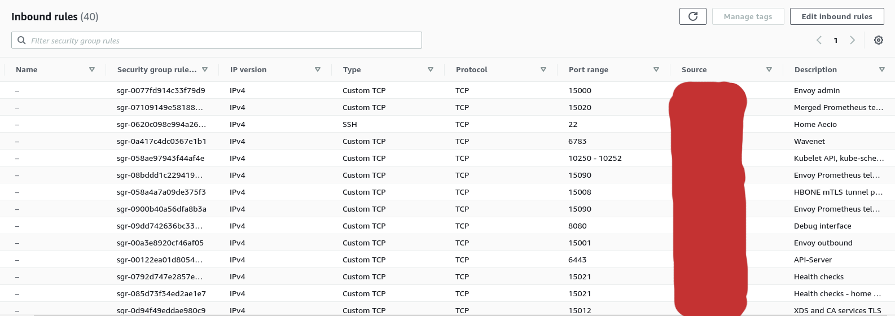
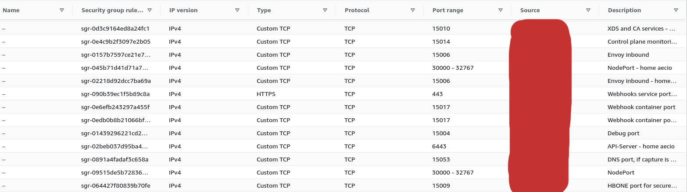
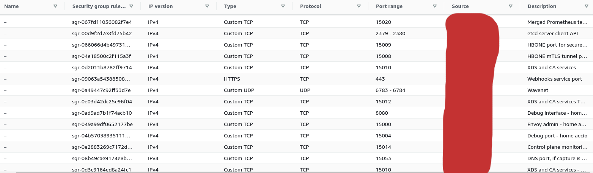

# learning-istio

Esta documentação foi gerada durante o estudo do curso **[Descomplicando Istio](https://www.linuxtips.io/products/descomplicando-o-istio)** da [LinuxTips](https://www.linuxtips.io), como uma forma de aprender a usar o Istio e os conceitos de Service mesh.

É recomendado ter um bom domínio sobre orquestração de conteinêres com Docker e Kubernetes antes de começar a estudar o Istio. Os links citados nas referências podem ajudar nisso.

Para fins de aprendizado, o Kubernetes foi provisionado manualmente em instâncias EC2 utilizando o [kubeadm](https://kubernetes.io/docs/setup/production-environment/tools/kubeadm/create-cluster-kubeadm/) para entender os requisitos de rede, hardware, software e o funcionamento dos componentes do Kubernetes e Istio. 

**Em ambientes de produção** é uma boa ideia utilizar serviços gerenciados como: [EKS](https://aws.amazon.com/eks), [GKE](https://cloud.google.com/kubernetes-engine), [AKS](https://azure.microsoft.com/en-us/free/kubernetes-service), [DOKS](https://www.digitalocean.com/products/kubernetes/), [k0s](https://k0sproject.io) entre outros.

**Em ambientes de desenvolvimento** é uma boa ideia utilizar o [kind](https://kind.sigs.k8s.io/), [microk8s](https://microk8s.io), [k3d](https://k3d.io) ou [minikube](https://minikube.sigs.k8s.io/). Este [repositório de Rafael Peroco](https://github.com/rafaelperoco/kind) cria um cluster Kubernetes utilizando o kind e inicia vários serviços. Ele dá a opção de usar o Service Mesh com o [Istio](https://istio.io) e o [Linkerd](https://linkerd.io).
# Configurações do Ambiente

As versões dos softwares utilizados foram:

* Docker: 20.04
* Kubernetes: 1.22.2
* Helm: 3.7.1
* Istio: 1.11.4

Instances:

* type: on-demand (t2.large 2 CPU e 8 GB de memória)
* SO: Ubuntu 20.04 64 bits
* login: ubuntu
* SSH: 22/TCP
* key: teste-aecio-treinamento-istio

```bash
ssh -o ServerAliveInterval=30 -i ~/teste-aecio-treinamento-istio.pem ubuntu@master
ssh -o ServerAliveInterval=30 -i ~/teste-aecio-treinamento-istio.pem ubuntu@worker1
ssh -o ServerAliveInterval=30 -i ~/teste-aecio-treinamento-istio.pem ubuntu@worker2
```

# Day 1

Veja os comandos [aqui](day1.md)

# Day 2

Veja os comandos [aqui](day2.md)

# Day 3

Veja os comandos [aqui](day3.md)

# Day 4

Veja os comandos [aqui](day4.md)

# Security group/firewall

> Para o Kubernetes e o Istio funcionarem corretamente, foi necessário liberar um conjunto de **40 portas** no security group associado as instâncias EC2, citados nos prints do diretório images.

Fonte:

* https://github.com/badtuxx/DescomplicandoKubernetes/blob/main/pt/day_one/descomplicando_kubernetes.md#portas-que-devemos-nos-preocupar
* https://istio.io/latest/docs/ops/deployment/requirements/

<p align="center">
  
</p>

<p align="center">
  
</p>

<p align="center">
  
</p>

# Referências

* https://github.com/badtuxx/DescomplicandoKubernetes
* https://github.com/badtuxx/DescomplicandoKubernetes/blob/main/pt/day_one/descomplicando_kubernetes.md
* http://blog.aeciopires.com/primeiros-passos-com-docker/
* https://helm.sh/docs/
* https://kubernetes.io/docs/setup/production-environment/tools/kubeadm/install-kubeadm/
* https://istio.io/latest/docs/setup/getting-started/
* https://istio.io/latest/docs/ops/deployment/requirements/
* https://istio.io/latest/docs/setup/install/istioctl/
* https://istio.io/latest/docs/setup/install/helm/
* https://www.alibabacloud.com/blog/kubernetes-configure-liveness-and-readiness-probes_594833 
* https://medium.com/sitewards/deploying-on-kubernetes-10-health-checking-a4986e807afe 
* https://githubmemory.com/repo/istio/istio/issues/32963 
* https://support.sisense.com/kb/en/article/pod-in-crashloopbackoff-state-readinessliveness-probe-failed-get-httppod-ip8082actuatorhealth-dial-tcp-pod-ip8082-connect-connection-refused 
* https://forums.rancher.com/t/liveness-probe-failed-connection-refused/20837 
* https://discuss.konghq.com/t/container-ingress-controller-failed-liveness-probe/6796
* https://www.udemy.com/course/istio-hands-on-for-kubernetes/
* https://academy.tetrate.io