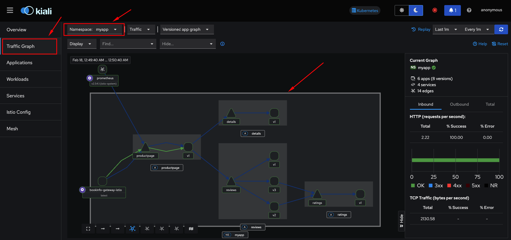

# Descomplicando Istio

<!-- TOC -->

- [Descomplicando Istio](#descomplicando-istio)
- [Day 1](#day-1)

<!-- TOC -->

# Day 1

Comandos executados em sequência durante o treinamento.

Instale o **Docker** com as instruções da página: [docker](docker.md).

Crie um **cluster Kubernetes** usando uma das opções abaixo:

* [kubeadm](kubeadm.md);
* [kind](kind.md);

Instale o **Helm** com as instruções da página: [helm](kind.md#helm).

Instale o **MetalLB** com as instruções da página: [metallb](kind.md#metallb).

Instale o **Istio** com os seguintes comandos:

```bash
#------- Specifics (master)
# References:
# https://istio.io/latest/docs/setup/getting-started/
# https://istio.io/latest/docs/setup/install/helm/
# Allow all these ports: https://istio.io/latest/docs/ops/deployment/requirements/

# Configure the Helm repository (ambient mode):
# https://istio.io/latest/docs/ambient/install/helm/
helm repo add istio https://istio-release.storage.googleapis.com/charts
helm repo update

# Install the Istio base components
helm -n istio-system install istio-base istio/base --create-namespace --wait

# Install or upgrade the Kubernetes Gateway API CRDs
kubectl get crd gateways.gateway.networking.k8s.io &> /dev/null || \
  { kubectl apply -f https://github.com/kubernetes-sigs/gateway-api/releases/download/v1.2.0/standard-install.yaml; }

# Install the Istiod, the control plane component that manages and configures the proxies to route traffic within the mesh
helm -n istio-system install istiod istio/istiod --set profile=ambient --wait

# Install CNI node agent. It is responsible for detecting the pods that belong to the ambient mesh, and configuring the traffic redirection between pods and the ztunnel node proxy (which will be installed later).
helm -n istio-system install istio-cni istio/cni --set profile=ambient --wait

# Install ztunnel DaemonSet, which is the node proxy component of Istio’s ambient mode.
helm -n istio-system install ztunnel istio/ztunnel --wait

# Install Ingress gateway
helm -n istio-system install istio-ingress istio/gateway --create-namespace --wait

# Validate the installation
helm -n istio-system ls
helm -n istio-system status istio-base
helm -n istio-system status istiod
helm -n istio-system status istio-cni
helm -n istio-system status ztunnel
helm -n istio-system status istio-ingress
kubectl -n istio-system get all --output wide

# To uninstall istio follow the instructions of the page
# https://istio.io/latest/docs/ambient/install/helm/#uninstall
```

Faça o deploy da aplicação de exemplo chamada **Bookinfo**.

> Documentação de referência para os arquivos e comandos mostrados a seguir:https://istio.io/latest/docs/ambient/getting-started/deploy-sample-app/.

Crie variáveis de ambiente uteis para baixar os arquivos complementares

```bash
export ISTIO_RELEASE=1.24
export ISTIO_BASE_URL="https://raw.githubusercontent.com/istio/istio/release-$ISTIO_RELEASE/samples/"
export ISTIO_BOOKINFO_URL="$ISTIO_BASE_URL/bookinfo/"
export ISTIO_ADDONS_URL="$ISTIO_BASE_URL/addons"
```

Instale a aplicação de exemplo:

```bash
MY_NAMESPACE='myapp'
kubectl create namespace $MY_NAMESPACE

kubectl -n $MY_NAMESPACE apply -f "$ISTIO_BOOKINFO_URL/platform/kube/bookinfo.yaml"
kubectl -n $MY_NAMESPACE apply -f "$ISTIO_BOOKINFO_URL/platform/kube/bookinfo-versions.yaml"
```

Visualize os objetos/recursos da aplicação:

```bash
kubectl -n $MY_NAMESPACE get all 
```

Teste o acesso a aplicação com o seguinte comando:

```bash
kubectl -n $MY_NAMESPACE exec "$(kubectl -n $MY_NAMESPACE get pod -l app=ratings -o jsonpath='{.items[0].metadata.name}')" -c ratings -- curl -sS productpage:9080/productpage | grep -o "<title>.*</title>"
```

Crie um ingressGateway e um HTTPRoute para a aplicação ser exposta fora do cluster usando o Istio e o loadbalancer.

```bash
kubectl -n $MY_NAMESPACE apply -f "$ISTIO_BOOKINFO_URL/gateway-api/bookinfo-gateway.yaml"
```

Por padrão, o Istio cria um serviço LoadBalancer para um gateway. Como você acessará esse gateway por um túnel, não precisa de um balanceador de carga. Altere o tipo de serviço para ClusterIP na anotation do gateway:

```bash
kubectl -n $MY_NAMESPACE annotate gateway bookinfo-gateway networking.istio.io/service-type=ClusterIP 
```

Para verificar o status do gateway, execute o seguinte comando:

```bash
kubectl -n $MY_NAMESPACE get gateway
```

Crie um port-forward para acessar a página do produto Bookinfo por meio do gateway que acabou de provisionar.

```bash
kubectl -n $MY_NAMESPACE port-forward svc/bookinfo-gateway-istio 8080:80
```

Usando o navegador, acesse a página http://localhost:8080/productpage.

<p align="center">
  
</p>

Visualize os objetos da aplicação recém Bookinfo.

```bash
kubectl -n $MY_NAMESPACE get gateway,httproute,service,pods,deployments,replicaset
```

Instale os seguintes addons para o Istio:

- [Grafana](https://grafana.com)
- [Prometheus](https://prometheus.io)
- [Kiali](https://kiali.io)
- [Jaeger](https://www.jaegertracing.io)

```bash
# Instalando os addons
kubectl apply -f "$ISTIO_ADDONS_URL/grafana.yaml"
kubectl apply -f "$ISTIO_ADDONS_URL/prometheus.yaml"
kubectl apply -f "$ISTIO_ADDONS_URL/kiali.yaml"
kubectl apply -f "$ISTIO_ADDONS_URL/jaeger.yaml"

# Verificando o status da instalação dos addons
kubectl rollout status deployment/grafana -n istio-system
kubectl rollout status deployment/prometheus -n istio-system
kubectl rollout status deployment/kiali -n istio-system
kubectl rollout status deployment/jaeger -n istio-system
```

Inicie um port-forward para cada addon.

```bash
kubectl -n istio-system port-forward service/grafana 3000:3000
kubectl -n istio-system port-forward service/prometheus 9090:9090
kubectl -n istio-system port-forward service/kiali 20001:20001
kubectl -n istio-system port-forward service/tracing 8081:80
```

Acesse cada addon nos seguintes endereços:

* Grafana: http://localhost:3000 (login: admin, senha: admin)
* Prometheus: http://localhost:9090
* Kiali: http://localhost:20001
* Jaeger: http://localhost:8081

Permita que o Istio gerencie as aplicações de determinado namespace (Ambient mode https://istio.io/latest/docs/ambient/getting-started/secure-and-visualize/):

```bash
kubectl label namespace $MY_NAMESPACE istio.io/dataplane-mode=ambient
```

Envie tráfego para o aplicativo Bookinfo, para que o Kiali gere o gráfico de tráfego:

```bash
for i in $(seq 1 10000); do curl -sSI -o /dev/null http://localhost:8080/productpage; done
```

Veja o resultado conforme mostrado na imagem a seguir:

<p align="center">
  
</p>

Liste os objetos do Istio e addons com os seguintes comandos:

```bash
kubectl api-resources | grep istio
kubectl get crd | grep istio
kubectl get all -n istio-system
kubectl get all -n istio-ingress
```
