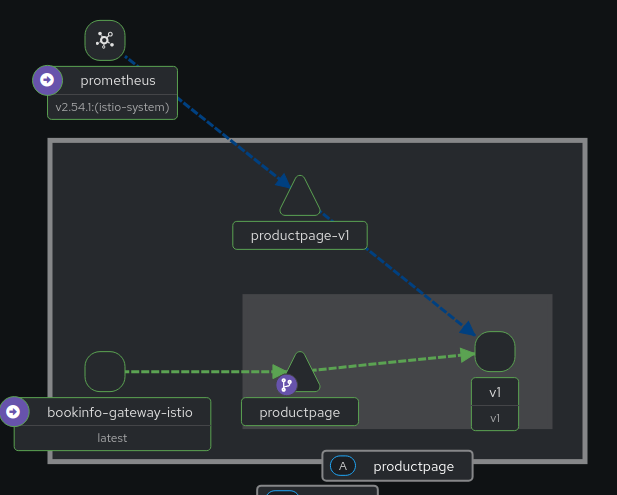

# Descomplicando Istio

<!-- TOC -->

- [Descomplicando Istio](#descomplicando-istio)
- [Day 2](#day-2)
- [Traffic management](#traffic-management)
  - [Request routing](#request-routing)
  - [Route based on user identity](#route-based-on-user-identity)
  - [Traffic shifting](#traffic-shifting)
  - [Fault injection](#fault-injection)
  - [Mirroring](#mirroring)

<!-- TOC -->

# Day 2

Estratégias de gerenciamento de tráfego (*traffic management*):

> - **traffic request** => roteamento baseado nas configurações das requisições (requests), como por exemplo campos do header.
> 
> - **traffic shifting** => roteamento baseado no peso (valor ou percentual) das requisições. É útil para **canary deploy**.
> 
> - **fault injection** => roteamento baseado em cenários de falhas das requisições para testar a resiliência das aplicações e microsserviços.
> 
> - **request timeout** => roteamento baseado em cenários em que ocorre timeout das requisições para testar a resiliência das aplicações e microsserviços.
> 
> - **circuit breaking** => roteamento baseado em cenários em que ocorre problemas de conectividade ou falha de um ou mais microsserviços que formam uma ou mais aplicações.
> 
> - **mirroring** => espelhamento de tráfego, bem útil para testes de uma versão nova de um aplicação sem impactar a versão em uso no ambiente de produção. Necessário ter o ambiente de produção replicado (duplica o custo). Necessário ter o ambiente de produção replicado (duplica o custo).O Istio descarta as requisições espelhadas após chegarem nas aplicações para evitar duplicidade no processamento para o usuário final.

Mais informações sobre os conceitos do Istio, podem ser encontrados nos links a seguir.

- https://istio.io/v1.26/docs/overview/what-is-istio/
- https://istio.io/v1.26/docs/overview/why-choose-istio/
- https://istio.io/v1.26/docs/overview/dataplane-modes/
- https://istio.io/v1.26/docs/concepts/
- https://istio.io/v1.26/docs/concepts/traffic-management/
- https://istio.io/v1.26/docs/concepts/security/
- https://istio.io/v1.26/docs/concepts/observability/
- https://istio.io/v1.26/docs/concepts/wasm/
- https://istio.io/v1.26/docs/setup/
- https://istio.io/v1.26/docs/ambient/
- https://istio.io/v1.26/docs/examples/
- https://istio.io/v1.26/docs/tasks/
- https://istio.io/v1.26/docs/ops/

# Traffic management

> Para mais informações sobre este assunto, acesse a página: https://istio.io/v1.26/docs/concepts/traffic-management/

Crie variáveis de ambiente uteis para baixar os arquivos complementares

```bash
export ISTIO_RELEASE=1.26
export VERSION_ISTIO="${ISTIO_RELEASE}.2"
export ISTIO_BASE_URL="https://raw.githubusercontent.com/istio/istio/release-$ISTIO_RELEASE/samples/"
export ISTIO_BOOKINFO_URL="$ISTIO_BASE_URL/bookinfo/"
export ISTIO_ADDONS_URL="$ISTIO_BASE_URL/addons"
export MY_NAMESPACE='myapp'
export ISTIO_HTTPBIN_URL="$ISTIO_BASE_URL/httpbin/"
```

Crie um port-forward para acessar a página do produto Bookinfo por meio do gateway que acabou de provisionar.

```bash
MY_NAMESPACE='myapp'
kubectl -n $MY_NAMESPACE port-forward svc/bookinfo-gateway-istio 8080:80
```

Usando o navegador, acesse a página http://localhost:8080/productpage.

Envie tráfego para o aplicativo Bookinfo, para que o Kiali gere o gráfico de tráfego:

```bash
for i in $(seq 1 10000); do curl -sSI -o /dev/null http://localhost:8080/productpage; done
```

## Request routing

> Para mais informações sobre esta atividade, acesse a página: https://istio.io/v1.26/docs/tasks/traffic-management/request-routing/#about-this-task

O Istio usa ``virtualservices`` para definir regras de rota. Execute o comando a seguir para aplicar serviços virtuais que roteiam todo o tráfego para ``v1`` de cada microsserviço:

```bash
kubectl -n $MY_NAMESPACE apply -f "$ISTIO_BOOKINFO_URL/networking/virtual-service-all-v1.yaml"
```

Obtenha informações sobre o status dos ``virtualservices`` e ``destinationrules``.

```bash
kubectl -n $MY_NAMESPACE get virtualservices
kubectl -n $MY_NAMESPACE get virtualservices -o yaml
```

Conforme mostra a figura abaixo, todo o tráfego entre as aplicações é destinado apenas para a ``v1``.

<p align="center">
  
</p>

O resultado esperado é explicado na página: https://istio.io/v1.26/docs/tasks/traffic-management/request-routing/#test-the-new-routing-configuration

## Route based on user identity

> Para mais informações sobre esta atividade, acesse a página: https://istio.io/v1.26/docs/tasks/traffic-management/request-routing/#route-based-on-user-identity

Altere a configuração da rota para que todo o tráfego de um usuário específico seja roteado para uma versão de serviço específica. Nesse caso, todo o tráfego de um usuário chamado ``Jason`` será roteado para o serviço ``reviews:v2``.

Este exemplo é habilitado pelo fato de que o serviço ``productpage`` adiciona um cabeçalho de usuário final personalizado a todas as solicitações HTTP de saída para o serviço reviews. O Istio também oferece suporte ao roteamento com base em JWT fortemente autenticado no gateway de entrada.

```bash
kubectl -n $MY_NAMESPACE apply -f "$ISTIO_BOOKINFO_URL/networking/virtual-service-reviews-test-v2.yaml"
```

Na página ``/productpage`` do **Bookinfo**, faça login como usuário ``jason``.

Atualize o navegador. O que você vê? As classificações por estrelas aparecem ao lado de cada avaliação.

Faça login como outro usuário (escolha qualquer nome que desejar).

Atualize o navegador. Agora as estrelas sumiram. Isso ocorre porque o tráfego é roteado para ``reviews:v1`` para todos os usuários, exceto ``Jason``.

Agora execute o seguinte comando para remover as configurações anteriores.

```bash
kubectl -n $MY_NAMESPACE delete -f "$ISTIO_BOOKINFO_URL/networking/virtual-service-all-v1.yaml"
kubectl -n $MY_NAMESPACE delete -f "$ISTIO_BOOKINFO_URL/networking/virtual-service-reviews-test-v2.yaml"
```

## Traffic shifting

> Para mais informações sobre esta atividade, acesse a página: https://istio.io/v1.26/docs/tasks/traffic-management/traffic-shifting/

Nesta tarefa, você enviará 50% do tráfego para ``reviews:v1`` e 50% para ``reviews:v3``. Então, você concluirá a migração enviando 100% do tráfego para ``reviews:v3``.

O Istio usa ``virtualservices`` para definir regras de rota. Execute o comando a seguir para aplicar serviços virtuais que roteiam todo o tráfego para ``v1`` de cada microsserviço:

```bash
kubectl -n $MY_NAMESPACE apply -f "$ISTIO_BOOKINFO_URL/networking/virtual-service-all-v1.yaml"
```

Obtenha informações sobre o status dos ``virtualservices``.

```bash
kubectl -n $MY_NAMESPACE get virtualservices
kubectl -n $MY_NAMESPACE get virtualservices -o yaml
```

Transfira 50% do tráfego de ``reviews:v1`` para ``reviews:v3`` com o seguinte comando:

```bash
kubectl -n $MY_NAMESPACE apply -f "$ISTIO_BOOKINFO_URL/networking/virtual-service-reviews-50-v3.yaml"
```

Supondo que você decida que o microsserviço ``reviews:v3`` é estável, você pode rotear 100% do tráfego para ``reviews:v3`` aplicando este comando:   

```bash
kubectl -n $MY_NAMESPACE apply -f "$ISTIO_BOOKINFO_URL/networking/virtual-service-reviews-v3.yaml"
```

Agora execute o seguinte comando para remover as configurações anteriores.

```bash
kubectl -n $MY_NAMESPACE delete -f "$ISTIO_BOOKINFO_URL/networking/virtual-service-all-v1.yaml"
```

## Fault injection

> Para mais informações sobre esta atividade, acesse a página: https://istio.io/v1.26/docs/tasks/traffic-management/fault-injection/

Nesta tarefa, você enviará 50% do tráfego para ``reviews:v1`` e 50% para ``reviews:v3``. Então, você concluirá a migração enviando 100% do tráfego para ``reviews:v3``.

O Istio usa ``virtualservices`` para definir regras de rota. Execute o comando a seguir para aplicar serviços virtuais que roteiam todo o tráfego para ``v1`` de cada microsserviço:

```bash
kubectl -n $MY_NAMESPACE apply -f "$ISTIO_BOOKINFO_URL/networking/virtual-service-all-v1.yaml"
kubectl -n $MY_NAMESPACE apply -f "$ISTIO_BOOKINFO_URL/networking/virtual-service-reviews-test-v2.yaml"
```

Com a execução dos comandos anteriores temos o seguinte cenário de tráfego entre os microsserviços:

- ``productpage`` → ``reviews:v2`` → ``ratings`` (somente para o usuário ``jason``)
- ``productpage`` → ``reviews:v1`` (para todos os outros)

Obtenha informações sobre o status dos ``virtualservices``.

```bash
kubectl -n $MY_NAMESPACE get virtualservices
kubectl -n $MY_NAMESPACE get virtualservices -o yaml
```

Para testar a resiliência dos microsserviços do aplicativo Bookinfo, injete um atraso de 7s entre os microsserviços ``reviews:v2`` e ``ratings`` para o usuário ``jason``. Este teste revelará um bug que foi introduzido intencionalmente no aplicativo Bookinfo.

Observe que o serviço ``reviews:v2`` tem um tempo limite de conexão codificado de 10s para chamadas ao serviço ``ratings``. Mesmo com o atraso de 7s que você introduziu, você ainda espera que o fluxo de ponta a ponta continue sem erros.

```bash
kubectl -n $MY_NAMESPACE apply -f "$ISTIO_BOOKINFO_URL/networking/virtual-service-ratings-test-delay.yaml"
```

Abra o aplicativo da web Bookinfo no seu navegador.

Na página da web ``/productpage``, faça login como usuário ``jason``.

Você espera que a página inicial do Bookinfo carregue sem erros em aproximadamente 7 segundos. No entanto, há um problema: a seção **Reviews** exibe uma mensagem de erro:

> Sorry, product reviews are currently unavailable for this book.

Veja os tempos de resposta da página da web:

Abra o menu **Ferramentas do desenvolvedor** no seu navegador. Abra a guia **Rede**. 

Recarregue a página da web ``/productpage``. Você verá que a página realmente carrega em cerca de 6 segundos.

O resultado é explicado na página: https://istio.io/v1.26/docs/tasks/traffic-management/fault-injection/#understanding-what-happened

Agora execute o seguinte comando para remover as configurações anteriores.

```bash
kubectl -n $MY_NAMESPACE delete -f "$ISTIO_BOOKINFO_URL/networking/virtual-service-all-v1.yaml"
```

## Mirroring

> Para mais informações sobre esta atividade, acesse a página: https://istio.io/v1.26/docs/tasks/traffic-management/mirroring/

Esta tarefa demonstra os recursos de espelhamento de tráfego do Istio.

O espelhamento de tráfego, também chamado de shadowing, é um conceito que permite que equipes de recursos tragam mudanças para a produção com o mínimo de risco possível. O espelhamento envia uma cópia do tráfego ativo para um serviço espelhado. O tráfego espelhado acontece fora da banda do caminho de solicitação crítica para o serviço primário.

Nesta tarefa, você primeiro forçará todo o tráfego para a ``v1`` de um serviço de teste. Em seguida, você aplicará uma regra para espelhar uma parte do tráfego para a ``v2``.

Faça deploy do httpbin com os comandos a seguir.

```bash
export LEARNING_ISTIO_TAG_REPOSITORY=v2.0.0
export LEARNING_ISTIO_BASE_URL="https://raw.githubusercontent.com/aeciopires/learning-istio/refs/tags/$LEARNING_ISTIO_TAG_REPOSITORY/"
kubectl -n $MY_NAMESPACE apply -f "$LEARNING_ISTIO_BASE_URL/files/mirroring/deployment-httpbin-v1.yaml"
kubectl -n $MY_NAMESPACE apply -f "$LEARNING_ISTIO_BASE_URL/files/mirroring/deployment-httpbin-v2.yaml"
kubectl -n $MY_NAMESPACE apply -f "$LEARNING_ISTIO_BASE_URL/files/mirroring/deployment-curl-sleep.yaml"
kubectl -n $MY_NAMESPACE apply -f "$LEARNING_ISTIO_BASE_URL/files/mirroring/service-httpbin.yaml"
```

Crie uma regra de rota padrão para rotear todo o tráfego para a ``v1`` do serviço HTTPBin:

```bash
kubectl -n $MY_NAMESPACE apply -f "$LEARNING_ISTIO_BASE_URL/files/mirroring/destination-rule-httpbin.yaml"
```

Agora, com todo o tráfego direcionado para ``httpbin:v1``, envie requisições ao serviço com o seguinte comando.

```bash
kubectl -n $MY_NAMESPACE exec deploy/curl -c curl -- curl -sS http://httpbin:8000/headers
```

Verifique os logs dos pods ``httpbin-v1`` e ``httpbin-v2``. Você deve ver entradas de log de acesso para ``v1`` e nenhuma para ``v2``:

```bash
kubectl -n $MY_NAMESPACE logs deploy/httpbin-v1 -c httpbin
kubectl -n $MY_NAMESPACE logs deploy/httpbin-v2 -c httpbin
```

Altere a regra de rota para espelhar o tráfego para ``httpbin-v2``:

```bash
kubectl -n $MY_NAMESPACE apply -f "$LEARNING_ISTIO_BASE_URL/files/mirroring/mirroring-httpbin.yaml"
```

Envie o tráfego novamente:

Agora, você deve ver o registro de acesso para ``v1`` e ``v2``. Os registros de acesso criados em ``v2`` são as solicitações espelhadas que estão realmente indo para ``v1``.

Agora execute os seguintes comandos para remover as configurações anteriores.

```bash
kubectl -n $MY_NAMESPACE delete virtualservice httpbin
kubectl -n $MY_NAMESPACE delete destinationrule httpbin
kubectl -n $MY_NAMESPACE delete deploy httpbin-v1 httpbin-v2 curl
kubectl -n $MY_NAMESPACE delete svc httpbin
```
